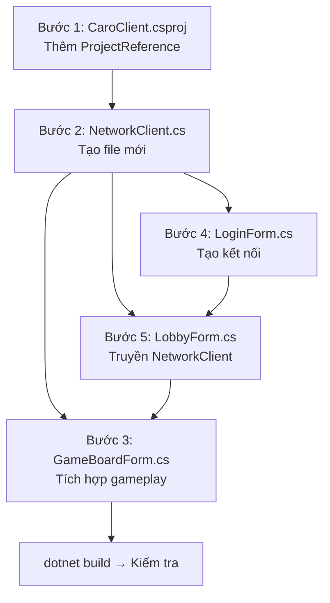

# Chi tiết các bước triển khai Feature/Client-Gameplay

> [!CAUTION]
> Chỉ sửa trong `CaroClient/`. Không chạm `CaroShared/` và `CaroServer/`.

---

## Bước 1: Thêm ProjectReference đến CaroShared

**File**: [CaroClient.csproj](file:///c:/Users/chitr/source/repos/Net3-Group03-UDM16/Code/UDM_16_CaroGame/CaroClient/CaroClient.csproj)

**Hiện tại** — không có reference nào:
```xml
<Project Sdk="Microsoft.NET.Sdk">
  <PropertyGroup>
    <OutputType>WinExe</OutputType>
    <TargetFramework>net10.0-windows</TargetFramework>
    <Nullable>enable</Nullable>
    <UseWindowsForms>true</UseWindowsForms>
    <ImplicitUsings>enable</ImplicitUsings>
  </PropertyGroup>
</Project>
```

**Cần thêm** sau `</PropertyGroup>`:
```xml
<ItemGroup>
  <ProjectReference Include="..\CaroShared\CaroShared.csproj" />
</ItemGroup>
```

**Lý do**: Cho phép CaroClient sử dụng `MakeMoveRequest`, `MoveMadeEventDto`, `NetworkMessage`, `MessageSerializer`, `MessageFrameDecoder`, `MessageType` từ CaroShared.

**Kiểm tra**: `dotnet build` phải thành công.

---

## Bước 2: Tạo `NetworkClient.cs`

**File mới**: `CaroClient/Network/NetworkClient.cs`

Đây là lớp **trung tâm** xử lý toàn bộ giao tiếp TCP. Sẽ được dùng bởi tất cả Form.

### 2.1. Khai báo class và fields

```
class NetworkClient : IDisposable
  Fields:
    - TcpClient _tcpClient
    - NetworkStream _stream
    - MessageSerializer _serializer      (từ CaroShared)
    - MessageFrameDecoder _decoder       (từ CaroShared)
    - CancellationTokenSource _cts       (để dừng receive loop)
    - bool _isConnected
    - SemaphoreSlim _sendLock            (tránh ghi stream đồng thời)
```

### 2.2. Events — giao tiếp với UI

```
  Events:
    - event Action<MoveMadeEventDto>? OnMoveMade
    - event Action<NetworkMessage>? OnGameOver
    - event Action<NetworkMessage>? OnMessageReceived   (catch-all cho các loại message khác)
    - event Action<Exception>? OnError
    - event Action? OnDisconnected
```

> [!NOTE]
> Tất cả event fire trên **background thread**. Form phải tự `Invoke()` về UI thread.

### 2.3. ConnectAsync(ip, port)

```
public async Task ConnectAsync(string ip, int port)
  1. _tcpClient = new TcpClient()
  2. await _tcpClient.ConnectAsync(ip, port)
  3. _stream = _tcpClient.GetStream()
  4. _isConnected = true
  5. _cts = new CancellationTokenSource()
  6. _ = Task.Run(() => ReceiveLoopAsync(_cts.Token))
       ↑ fire-and-forget, chạy nền
```

### 2.4. SendMessageAsync(msg)

```
public async Task SendMessageAsync(NetworkMessage msg)
  1. if (!_isConnected) throw
  2. string json = _serializer.Serialize(msg)      // kết quả đã có "\n" ở cuối
  3. byte[] bytes = Encoding.UTF8.GetBytes(json)
  4. await _sendLock.WaitAsync()
  5. try:
       await _stream.WriteAsync(bytes)
       await _stream.FlushAsync()
  6. finally:
       _sendLock.Release()
```

> [!TIP]
> `SemaphoreSlim` cần thiết vì nhiều chỗ có thể gọi `SendMessageAsync` đồng thời (ví dụ user click nhanh + timer gửi heartbeat).

### 2.5. ReceiveLoopAsync(token) — vòng lặp nhận dữ liệu

```
private async Task ReceiveLoopAsync(CancellationToken token)
  1. byte[] buffer = new byte[4096]
  2. while (!token.IsCancellationRequested):
       a. int bytesRead = await _stream.ReadAsync(buffer, token)
       b. if bytesRead == 0 → server đóng kết nối:
            _isConnected = false
            OnDisconnected?.Invoke()
            break
       c. string data = Encoding.UTF8.GetString(buffer, 0, bytesRead)
       d. IReadOnlyList<string> frames = _decoder.Decode(data)
       e. foreach frame in frames:
            DispatchMessage(frame)
  3. catch OperationCanceledException → bỏ qua (dừng loop bình thường)
  4. catch Exception ex → OnError?.Invoke(ex)
```

### 2.6. DispatchMessage(frame) — phân phối message theo Type

```
private void DispatchMessage(string frame)
  1. NetworkMessage msg = _serializer.Deserialize(frame)
  2. switch (msg.Type):
       case MessageType.MoveMadeEvent:
           var dto = _serializer.DeserializePayload<MoveMadeEventDto>(msg)
           OnMoveMade?.Invoke(dto)
           break

       case MessageType.GameOverEvent:
           OnGameOver?.Invoke(msg)
           break

       default:
           OnMessageReceived?.Invoke(msg)
           break
```

### 2.7. Disconnect() + Dispose()

```
public void Disconnect()
  1. _isConnected = false
  2. _cts?.Cancel()
  3. _stream?.Close()
  4. _tcpClient?.Close()

public void Dispose()
  1. Disconnect()
  2. _cts?.Dispose()
  3. _sendLock?.Dispose()
```

---

## Bước 3: Sửa `GameBoardForm.cs`

**File**: [GameBoardForm.cs](file:///c:/Users/chitr/source/repos/Net3-Group03-UDM16/Code/UDM_16_CaroGame/CaroClient/GameBoardForm.cs)

### 3.1. Thêm fields gameplay state

```
Thêm ở đầu class (sau dòng 11):
  - private NetworkClient? _networkClient;
  - private string _myPlayerId = string.Empty;
  - private int _mySymbol;          // 1=X hoặc 2=O
  - private bool _isMyTurn;
  - private bool _isGameOver;
  - private int _moveCountP1;
  - private int _moveCountP2;
```

### 3.2. Thêm constructor mới (giữ constructor cũ cho Designer)

```
Giữ nguyên constructor không tham số (Designer cần):
  public GameBoardForm() { ... }   ← KHÔNG SỬA

Thêm constructor mới:
  public GameBoardForm(NetworkClient client, string myPlayerId,
                       int mySymbol, string p1Name, string p2Name)
      : this()     ← gọi constructor cũ để InitializeComponent + InitBoard
  {
      _networkClient = client;
      _myPlayerId = myPlayerId;
      _mySymbol = mySymbol;
      _isMyTurn = (mySymbol == 1);   // X đi trước

      // Cập nhật tên player trên UI
      lblPlayer1Name.Text = p1Name;
      lblPlayer2Name.Text = p2Name;

      // Đăng ký nhận event từ server
      _networkClient.OnMoveMade += HandleMoveMade;
      _networkClient.OnGameOver += HandleGameOver;

      // Cập nhật indicator lượt đi ban đầu
      UpdateTurnIndicator();
  }
```

### 3.3. Sửa `Cell_Click` — thêm kiểm tra lượt

```
Hiện tại (dòng 92-104):
  Cell_Click:
    if sender is not Button → return
    lấy (row, col)
    if ô đã đánh → return
    SendMove(row, col)

Sửa thành:
  Cell_Click:
    if sender is not Button → return
    lấy (row, col)
    if _isGameOver → return                    ← THÊM
    if !_isMyTurn → return                     ← THÊM
    if ô đã đánh → return
    SendMove(row, col)
```

### 3.4. Sửa `SendMove(row, col)` — thay `throw` bằng logic gửi

```
Hiện tại (dòng 115-120):
  private void SendMove(int row, int col)
  {
      throw new NotImplementedException(...);
  }

Sửa thành:
  private async void SendMove(int row, int col)
  {
      if (_networkClient == null) return;

      _isMyTurn = false;    // Chặn click tiếp ngay lập tức

      var request = new MakeMoveRequest { X = col, Y = row };
      var msg = new NetworkMessage(MessageType.MakeMoveRequest, request);

      try
      {
          await _networkClient.SendMessageAsync(msg);
      }
      catch (Exception ex)
      {
          _isMyTurn = true;  // Lỗi → cho đánh lại
          MessageBox.Show($"Lỗi gửi nước đi: {ex.Message}", "Lỗi",
              MessageBoxButtons.OK, MessageBoxIcon.Error);
      }
  }
```

> [!NOTE]
> `X = col, Y = row` theo quy ước của `MakeMoveRequest` trong CaroShared.

### 3.5. Thêm `HandleMoveMade` — xử lý nước đi từ server

```
private void HandleMoveMade(MoveMadeEventDto dto)
{
    if (IsDisposed) return;

    this.Invoke(() =>
    {
        // 1. Nước đi không hợp lệ → cho đánh lại
        if (!dto.IsValid)
        {
            MessageBox.Show(dto.ErrorMessage, "Không hợp lệ",
                MessageBoxButtons.OK, MessageBoxIcon.Warning);
            _isMyTurn = true;
            return;
        }

        // 2. Xác định symbol: ai vừa đánh?
        bool isMyMove = (dto.PlayerId == _myPlayerId);
        int symbol = isMyMove ? _mySymbol : (_mySymbol == 1 ? 2 : 1);

        // 3. Cập nhật 1 ô trên bàn cờ
        int row = dto.Y;
        int col = dto.X;
        _board[row][col] = symbol;
        _cells[row, col].Text = symbol == 1 ? "X" : "O";
        _cells[row, col].ForeColor = symbol == 1 ? Color.DarkBlue : Color.DarkRed;

        // 4. Cập nhật đếm nước đi
        if (symbol == 1) _moveCountP1++;
        else             _moveCountP2++;
        lblPlayer1MoveCount.Text = _moveCountP1.ToString();
        lblPlayer2MoveCount.Text = _moveCountP2.ToString();

        // 5. Chuyển lượt
        _isMyTurn = !isMyMove;
        UpdateTurnIndicator();

        // 6. Kiểm tra kết thúc game
        if (dto.WinnerSymbol != 0)
        {
            ShowGameResult(dto.WinnerSymbol);
        }
    });
}
```

### 3.6. Thêm `HandleGameOver` — xử lý đầu hàng/timeout

```
private void HandleGameOver(NetworkMessage msg)
{
    if (IsDisposed) return;

    this.Invoke(() =>
    {
        // Cố gắng đọc payload nếu có
        try
        {
            var serializer = new MessageSerializer();
            var dto = serializer.DeserializePayload<MoveMadeEventDto>(msg);
            ShowGameResult(dto.WinnerSymbol);
        }
        catch
        {
            // Payload không parse được → hiển thị thông báo chung
            ShowGameResult(0);  // 0 = hòa / không xác định
        }
    });
}
```

### 3.7. Thêm `ShowGameResult(int winnerSymbol)`

```
private void ShowGameResult(int winnerSymbol)
{
    _isGameOver = true;

    // Disable toàn bộ ô cờ
    SetBoardEnabled(false);

    // Xác định thông báo
    string message;
    string title;
    MessageBoxIcon icon;

    if (winnerSymbol == 0)
    {
        message = "Trận đấu kết thúc hòa!";
        title = "Hòa";
        icon = MessageBoxIcon.Information;
    }
    else if (winnerSymbol == _mySymbol)
    {
        message = "🎉 Chúc mừng! Bạn đã thắng!";
        title = "Chiến thắng";
        icon = MessageBoxIcon.Information;
    }
    else
    {
        message = "😢 Bạn đã thua! Chúc may mắn lần sau.";
        title = "Thua cuộc";
        icon = MessageBoxIcon.Information;
    }

    MessageBox.Show(message, title, MessageBoxButtons.OK, icon);
}
```

### 3.8. Thêm helper methods

```
private void UpdateTurnIndicator()
{
    if (_isMyTurn)
    {
        // Highlight panel của mình
        if (_mySymbol == 1)
        {
            pnlPlayer1Turn.Text = "▶ Lượt của bạn";
            pnlPlayer1Turn.ForeColor = Color.Green;
            pnlPlayer2Turn.Text = "Chờ...";
            pnlPlayer2Turn.ForeColor = Color.Gray;
        }
        else
        {
            pnlPlayer2Turn.Text = "▶ Lượt của bạn";
            pnlPlayer2Turn.ForeColor = Color.Green;
            pnlPlayer1Turn.Text = "Chờ...";
            pnlPlayer1Turn.ForeColor = Color.Gray;
        }
    }
    else
    {
        // Highlight panel đối thủ
        if (_mySymbol == 1)
        {
            pnlPlayer1Turn.Text = "Chờ...";
            pnlPlayer1Turn.ForeColor = Color.Gray;
            pnlPlayer2Turn.Text = "▶ Đang đánh...";
            pnlPlayer2Turn.ForeColor = Color.Orange;
        }
        else
        {
            pnlPlayer2Turn.Text = "Chờ...";
            pnlPlayer2Turn.ForeColor = Color.Gray;
            pnlPlayer1Turn.Text = "▶ Đang đánh...";
            pnlPlayer1Turn.ForeColor = Color.Orange;
        }
    }
}

private void SetBoardEnabled(bool enabled)
{
    for (int r = 0; r < BoardSize; r++)
        for (int c = 0; c < BoardSize; c++)
            _cells[r, c].Enabled = enabled;
}
```

### 3.9. Sửa `button1_Click` (Đầu hàng)

```
Hiện tại (dòng 167-172):
  throw new NotImplementedException(...)

Sửa thành:
  private async void button1_Click(object sender, EventArgs e)
  {
      if (_isGameOver || _networkClient == null) return;

      var result = MessageBox.Show(
          "Bạn có chắc chắn muốn đầu hàng?",
          "Xác nhận đầu hàng",
          MessageBoxButtons.YesNo,
          MessageBoxIcon.Warning);

      if (result == DialogResult.Yes)
      {
          var msg = new NetworkMessage(MessageType.GameOverEvent, null);
          await _networkClient.SendMessageAsync(msg);
          // Chờ server gửi lại GameOverEvent xác nhận → HandleGameOver xử lý
      }
  }
```

### 3.10. Sửa `button3_Click` (Ván mới)

```
Hiện tại (dòng 177-182):
  throw new NotImplementedException(...)

Sửa thành:
  private void button3_Click(object sender, EventArgs e)
  {
      if (!_isGameOver) return;   // Chỉ cho phép khi game đã kết thúc

      ResetBoard();
      _isGameOver = false;
      _moveCountP1 = 0;
      _moveCountP2 = 0;
      lblPlayer1MoveCount.Text = "0";
      lblPlayer2MoveCount.Text = "0";
      _isMyTurn = (_mySymbol == 1);
      UpdateTurnIndicator();
      SetBoardEnabled(true);
  }
```

### 3.11. Cleanup khi đóng Form

```
Thêm vào cuối class:
  protected override void OnFormClosing(FormClosingEventArgs e)
  {
      // Hủy đăng ký event tránh memory leak
      if (_networkClient != null)
      {
          _networkClient.OnMoveMade -= HandleMoveMade;
          _networkClient.OnGameOver -= HandleGameOver;
      }
      base.OnFormClosing(e);
  }
```

---

## Bước 4: Sửa `LoginForm.cs`

**File**: [LoginForm.cs](file:///c:/Users/chitr/source/repos/Net3-Group03-UDM16/Code/UDM_16_CaroGame/CaroClient/LoginForm.cs)

### 4.1. Thêm field

```
Thêm ở đầu class:
  private NetworkClient? _networkClient;
```

### 4.2. Sửa `BtnConnect_Click` — tạo kết nối thật

```
Hiện tại (dòng 105-112):
  PlayerName = TxtNickname.Text.Trim();
  ServerIp = TxtServerIp.Text.Trim();
  ServerPort = port;
  LobbyForm lobby = new LobbyForm(PlayerName);
  this.Hide();
  lobby.ShowDialog();
  this.Close();

Sửa thành:
  PlayerName = TxtNickname.Text.Trim();
  ServerIp = TxtServerIp.Text.Trim();
  ServerPort = port;

  // Tạo kết nối TCP
  _networkClient = new NetworkClient();
  try
  {
      await _networkClient.ConnectAsync(ServerIp, ServerPort);
  }
  catch (Exception ex)
  {
      MessageBox.Show($"Không thể kết nối server: {ex.Message}",
          "Lỗi kết nối", MessageBoxButtons.OK, MessageBoxIcon.Error);
      _networkClient.Dispose();
      _networkClient = null;
      return;
  }

  // Truyền NetworkClient qua LobbyForm
  LobbyForm lobby = new LobbyForm(PlayerName, _networkClient);
  this.Hide();
  lobby.ShowDialog();
  this.Close();
```

> [!NOTE]
> Method `BtnConnect_Click` cần đổi signature thành `async void` để dùng `await`.

---

## Bước 5: Sửa `LobbyForm.cs`

**File**: [LobbyForm.cs](file:///c:/Users/chitr/source/repos/Net3-Group03-UDM16/Code/UDM_16_CaroGame/CaroClient/LobbyForm.cs)

### 5.1. Thêm field + sửa constructor

```
Thêm field:
  private NetworkClient? _networkClient;

Sửa constructor có tham số (dòng 24-34):
  public LobbyForm(string playerName, NetworkClient networkClient) : this()
  {
      PlayerName = playerName;
      _networkClient = networkClient;
      LblWelcome.Text = $"Xin chào, {PlayerName}!";
      // ... giữ nguyên phần Paint event
  }
```

### 5.2. Sửa `BtnJoinRoom_Click` — mở GameBoardForm

```
Hiện tại (dòng 88-104):
  ... validate roomCode ...
  MessageBox.Show($"Đang tham gia phòng: {roomCode}", ...);

Sửa phần cuối thành:
  // Mở bàn cờ (tạm dùng giá trị mặc định — sau này lấy từ server)
  var gameForm = new GameBoardForm(
      _networkClient!,
      "local_player",     // TODO: lấy myPlayerId từ server
      1,                  // TODO: lấy mySymbol từ server (1=X, 2=O)
      PlayerName,         // Player 1 name
      "Đối thủ"           // TODO: lấy tên đối thủ từ server
  );
  this.Hide();
  gameForm.ShowDialog();
  this.Show();
```

> [!WARNING]
> Các giá trị `myPlayerId`, `mySymbol`, tên đối thủ tạm hardcode. Sẽ được thay bằng dữ liệu thực khi team server triển khai `LoginResponse` và `ChallengeResponse`.

---

## Thứ tự thực hiện



> [!TIP]
> **Bước 1 → 2** phải làm trước (dependency). Bước 3, 4, 5 có thể làm song song sau khi có NetworkClient, nhưng nên làm theo thứ tự 4 → 5 → 3 để flow kết nối hoàn chỉnh từ đầu.
